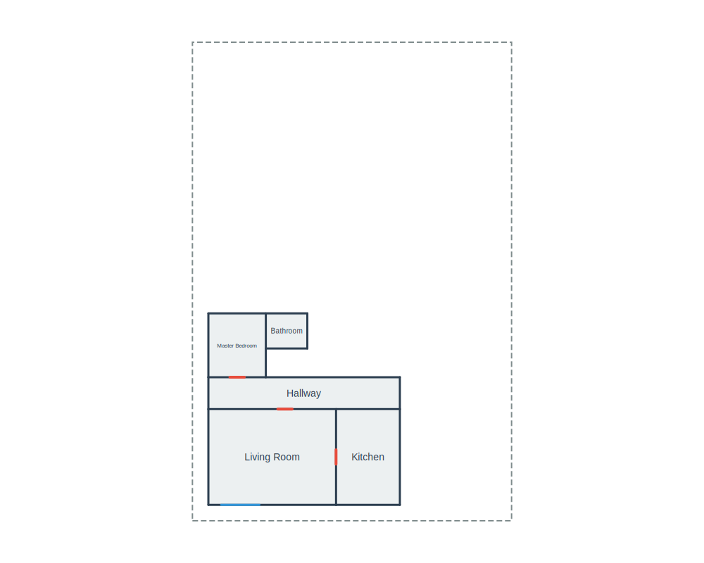
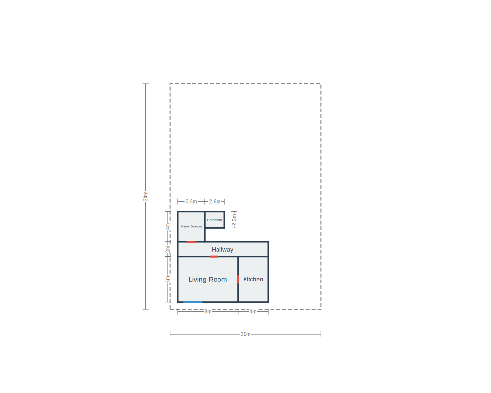

# 🏠 PlanScript

A **deterministic, textual DSL** for defining 2D architectural floor plans. Write human-readable code, compile to precise geometry.

<p align="center">
  
</p>

## ✨ Features

- **📝 Human & LLM Friendly** — Simple, repetitive syntax that's easy to write and generate
- **🎯 Deterministic** — Same input always produces the same output, no heuristics or AI magic
- **🔧 Compiler-based** — Parse → Validate → Generate pipeline with clear error messages
- **📐 Precise Geometry** — Exact coordinates, walls, and openings from high-level descriptions
- **🖼️ Multiple Exports** — SVG (with optional dimensions), JSON geometry IR
- **✅ Built-in Validation** — Assert constraints like no overlaps, minimum areas, containment

## 🎯 Design Philosophy

PlanScript is intentionally **limited in scope**:

| ✅ What it does | ❌ What it doesn't do |
|-----------------|----------------------|
| Spatial layout (rooms, walls, doors, windows) | Plumbing, electrical, HVAC |
| Deterministic compilation | Generative/AI design |
| Precise geometry output | Aesthetic decisions |
| Clear validation errors | "Best layout" optimization |

> *It trades creativity for **precision, repeatability, and correctness**.*

## 📖 Example

```planscript
units m
defaults {
  door_width 0.9
  window_width 2.4
}

plan "Example House" {
  footprint rect (0,0) (20,30)

  room living {
    rect (1,1) (9,7)
    label "Living Room"
  }

  room kitchen {
    rect size (4,6)
    attach east_of living
    align top
    gap 0
    label "Kitchen"
  }

  room hall {
    rect span x from living.left to kitchen.right y (7, 9)
    label "Hallway"
  }

  room bedroom {
    rect at (1,9) size (3.6,4.0)
    label "Master Bedroom"
  }

  room bath {
    rect size (2.6,2.2)
    attach east_of bedroom
    align top
    label "Bathroom"
  }

  opening door d1 { between living and hall on shared_edge at 60% }
  opening door d2 { between living and kitchen on shared_edge at 50% }
  opening door d3 { between hall and bedroom on shared_edge at 50% }
  opening window w1 { on living.edge south at 2.0 }

  assert no_overlap rooms
  assert inside footprint all_rooms
}
```

**Output:**

<p align="center">
  
  
</p>

<p align="center">
  <em>Default output</em> ・ <em>With <code>--dimensions</code> flag</em>
</p>

## 📦 Installation

```bash
npm install planscript
```

## 🖥️ CLI Usage

```bash
# Compile to SVG
planscript house.psc --svg house.svg

# Compile to SVG with dimension lines
planscript house.psc --svg house.svg --dimensions

# Compile to JSON
planscript house.psc --json house.json

# Both outputs
planscript house.psc --svg house.svg --json house.json
```

## 📚 Library Usage

### Simple Compilation

```typescript
import { compile } from 'planscript';

const source = `
  plan "My House" {
    footprint rect (0,0) (10,8)
    room living { rect (0,0) (10,8) label "Living Room" }
  }
`;

const result = compile(source);

if (result.success) {
  console.log(result.svg);      // SVG string
  console.log(result.geometry); // Geometry IR
} else {
  console.error(result.errors);
}
```

### Step-by-Step Pipeline

```typescript
import {
  parse,
  lower,
  generateGeometry,
  validate,
  exportSVG,
  exportJSON
} from 'planscript';

// 1. Parse source to AST
const ast = parse(source);

// 2. Lower to resolved geometry
const lowered = lower(ast);

// 3. Generate geometry IR (walls, openings)
const geometry = generateGeometry(lowered);

// 4. Validate assertions
const errors = validate(lowered, geometry);
if (errors.length > 0) {
  throw new Error(errors[0].message);
}

// 5. Export
const svg = exportSVG(geometry, { showDimensions: true });
const json = exportJSON(geometry, { pretty: true });
```

### Export Options

```typescript
const svg = exportSVG(geometry, {
  width: 1000,           // Canvas width (default: 1000)
  height: 800,           // Canvas height (default: 800)
  padding: 50,           // Padding around floor plan (default: 50)
  showDimensions: true,  // Show dimension lines (default: false)
  showLabels: true,      // Show room labels (default: true)
  wallColor: '#2c3e50',
  roomFillColor: '#ecf0f1',
  doorColor: '#e74c3c',
  windowColor: '#3498db',
});
```

## 📐 Language Syntax

For the complete language specification, see the **[Language Reference](LANGUAGE_REFERENCE.md)**.

### Quick Overview

```planscript
units m                    # meters, cm, mm, ft, in

defaults {
  door_width 0.9           # default door width
  window_width 1.2         # default window width
}

plan "House Name" {
  footprint rect (0,0) (20,15)

  # Rooms - multiple ways to define
  room living { rect (0,0) (8,6) }                           # two corners
  room bed { rect at (0,6) size (4,4) }                      # position + size
  room kitchen { rect size (4,6) attach east_of living }     # relative placement
  room hall { rect span x from living.left to bed.right y (6,8) }  # span

  # Openings
  opening door d1 { between living and hall on shared_edge at 50% }
  opening window w1 { on living.edge south at 2.0 width 1.5 }

  # Validation
  assert no_overlap rooms
  assert inside footprint all_rooms
  assert min_room_area bed >= 12
}
```

## 🤖 Using with LLMs

PlanScript is designed to be **LLM-friendly**. When asking ChatGPT, Claude, or other LLMs to generate floor plans:

1. **Provide the [LANGUAGE_REFERENCE.md](LANGUAGE_REFERENCE.md)** as context
2. Describe your floor plan requirements
3. The LLM can generate valid PlanScript code
4. Compile and iterate on errors if needed

The deterministic nature means: **LLM generates → Compiler validates → LLM fixes → Repeat until valid**

## 🔌 VS Code Extension

The PlanScript VS Code extension provides:
- 🎨 Syntax highlighting
- 🔗 Go to Definition (Ctrl+Click on room names)
- 💬 Hover information
- 📋 Document outline
- ⌨️ Autocomplete

### Installation

**From VS Code Marketplace:**
1. Open VS Code
2. Go to Extensions (Ctrl+Shift+X)
3. Search for "PlanScript"
4. Click Install

**From GitHub:**
```bash
git clone https://github.com/jfromaniello/vscode-planscript
cd vscode-planscript
npm install && npm run compile
code --install-extension .
```

## 🗺️ Roadmap

Future extensions (not in v1):
- 🔄 Curved walls (`arc`)
- 🏢 Multi-level plans
- 🪑 Furniture placement
- 📏 More export formats (DXF, PDF)

## 📄 License

MIT
